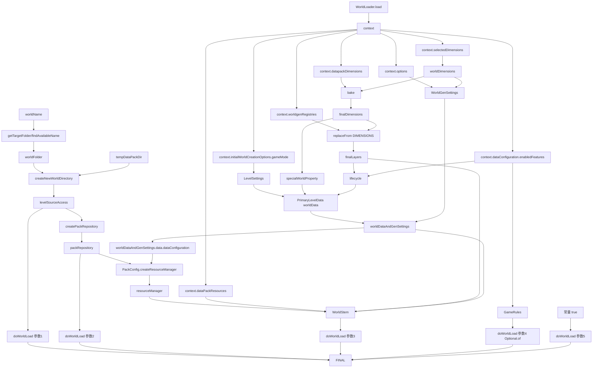

# `doWorldLoad` 参数依赖图与最小发包单元（基于 `PackedPipeline#createNewWorld`）

> 目标：从 `mc.doWorldLoad(...)` 反推每个入参的数据来源，并据此给出服务端发包的最小参数单元。

## 1) `doWorldLoad` 五个入参（调用点）

```java
mc.doWorldLoad(
    levelSourceAccess,
    packRepository,
    new WorldStem(resourceManager, context.dataPackResources(), finalLayers, worldDataAndGenSettings),
    Optional.of(gameRules),
    true
);
```

## 2) 参数依赖关系数据流（简图）



## 3) 五个参数的来源路径（逐项）

- 参数1 `levelSourceAccess`
  - `worldName -> worldFolder -> createNewWorldDirectory(...) -> newWorldAccess.get()`
- 参数2 `packRepository`
  - `ServerPacksSource.createPackRepository(levelSourceAccess)`
- 参数3 `WorldStem(resourceManager, serverResources, finalLayers, worldDataAndGenSettings)`
  - `resourceManager`: `new PackConfig(packRepository, worldDataAndGenSettings.data().getDataConfiguration(), ...).createResourceManager().getSecond()`
  - `serverResources`: `context.dataPackResources()`
  - `finalLayers`: `context.worldgenRegistries().replaceFrom(DIMENSIONS, bakedDimensionsRegistry)`
  - `worldDataAndGenSettings`: `PrimaryLevelData + WorldGenSettings`
- 参数4 `Optional.of(gameRules)`
  - `isDebug ? DEFAULT_GAME_RULES(ADVANCE_TIME=false) : new GameRules(...).copy(enabledFeatures)`
- 参数5 `true`
  - 常量，表示新世界加载路径

## 4) 由依赖图推导的“最小发包单元”

先定义判断标准：
- 如果某值可以在客户端通过固定逻辑稳定推导，则不必发包。
- 如果你希望由服务端指定并可复现，则必须进入 payload。

### A. 严格最小（复用当前本地默认逻辑）

- 只发：`worldName`

说明：其余值都在客户端通过 `WorldLoader.load + context + 默认分支` 推导。

### B. 可控最小（建议，服务端可指定关键玩法）

- `worldIdentity`
  - `folderName` 或 `worldName`
  - `displayName`（避免与目录名不一致）
- `gameplay`
  - `gameMode`
  - `difficultySettings`（difficulty + 两个布尔位）
  - `allowCommands`
- `gameRules`（建议全量键值，不只增量）

说明：这一组已覆盖你提到的难度/规则/模式。

### C. 全量可复现最小（服务端完全主导）

在 B 基础上再加：
- `worldGen`
  - `worldOptions`（seed、structures、bonusChest 等版本字段）
  - `dimensionsSpec`（preset id 或完整维度定义）
- `contentConfig`
  - `dataPacks.enabled/disabled`
  - `featureFlags`

说明：这一组能把 `context` 的关键可变输入转移到服务端控制侧，保证跨端一致性。

## 5) 推荐 payload 结构（可直接映射协议）

```json
{
  "worldIdentity": {
    "folderName": "string",
    "displayName": "string"
  },
  "contentConfig": {
    "enabledDataPacks": ["vanilla"],
    "disabledDataPacks": [],
    "featureFlags": ["minecraft:vanilla"]
  },
  "worldGen": {
    "worldOptions": {
      "seed": 123456789,
      "generateStructures": true,
      "bonusChest": false
    },
    "dimensions": {
      "mode": "preset",
      "presetId": "minecraft:normal"
    }
  },
  "gameplay": {
    "gameMode": "SURVIVAL",
    "difficulty": "NORMAL",
    "difficultyFlag1": false,
    "difficultyFlag2": false,
    "allowCommands": true
  },
  "gameRules": {
    "doDaylightCycle": "true",
    "keepInventory": "false"
  }
}
```

## 6) 结论（用于你定最小参数单元）

- 想保持现状最小：`worldName` 就够。
- 想让服务器指定玩法：至少发 `worldIdentity + gameplay + gameRules`。
- 想全流程可复现可控：发 `worldIdentity + contentConfig + worldGen + gameplay + gameRules`。

