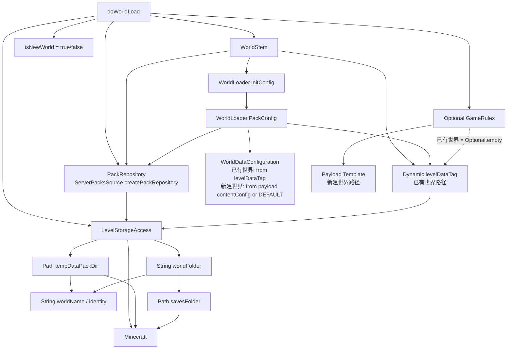

```mermaid
flowchart TD
    S[doWorldLoad] --> P1[LevelStorageAccess]
    S --> P2[PackRepository\nServerPacksSource.createPackRepository]
    S --> P3[WorldStem]
    S --> P4[Optional GameRules]
    S --> P5[isNewWorld = true/false]

    %% ── 参数① LevelStorageAccess ──
    P1 --> MC[Minecraft]
    P1 --> P12[String worldFolder]
    P1 --> P13[Path tempDataPackDir]

    P13 --> MC
    P13 --> WN[String worldName / identity]
    P12 --> WN
    P12 --> SF[Path savesFolder]
    SF --> MC

    %% ── 参数② PackRepository（唯一，来自 LevelStorageAccess，服务端方式）──
    P2 --> P1

    %% ── levelDataTag（已有世界路径，来自 LevelStorageAccess）──
    LDT[Dynamic levelDataTag\n已有世界路径] --> P1

    %% ── 参数③ WorldStem ──
    P3 --> WLIC[WorldLoader.InitConfig]
    P3 --> LDT
    P3 --> P2

    WLIC --> WLPC[WorldLoader.PackConfig]
    WLPC --> P2
    WLPC --> LDT
    WLPC --> WDC[WorldDataConfiguration\n已有世界: from levelDataTag\n新建世界: from payload contentConfig or DEFAULT]

    %% ── 参数④ GameRules ──
    P4 --> PAYLOAD[Payload Template\n新建世界路径]
    P4 -.->|已有世界 = Optional.empty| LDT
```